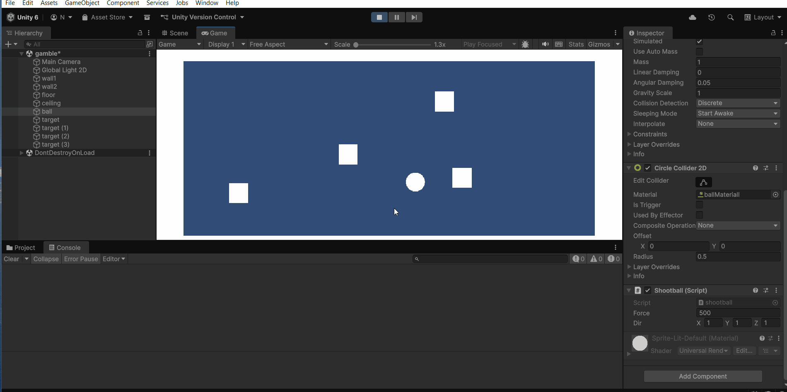
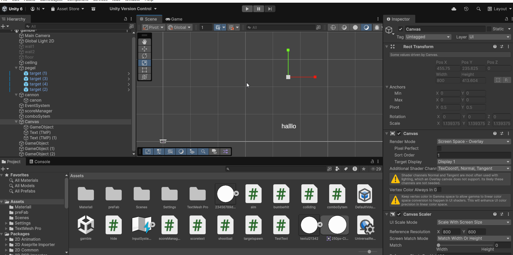
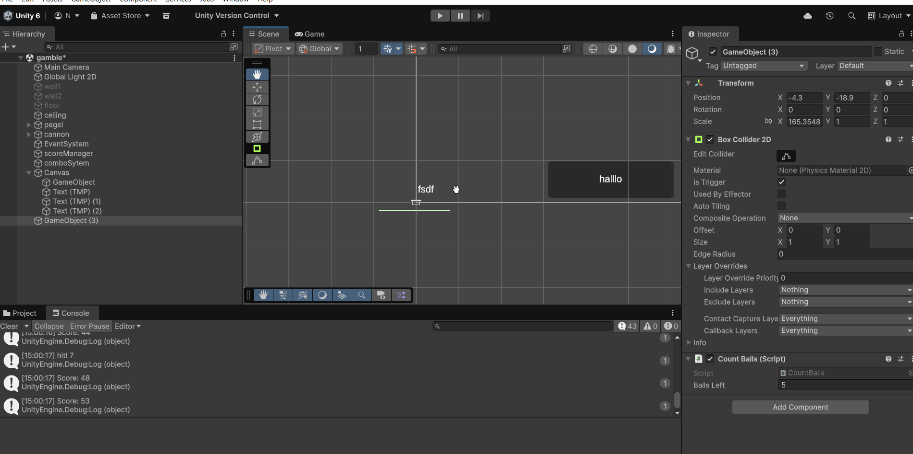
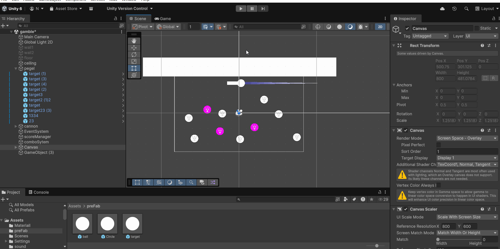
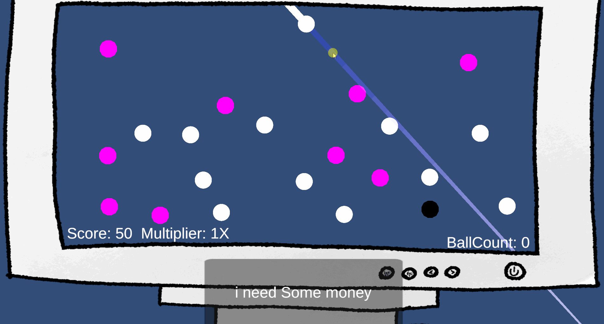

# gdv-physics-game
## gamble
## 

* idee story
* psychological horror
* je zit de gamble speel te spelen iemand of iets zit achter je aan je hebt iets gedaan waar je zelf niet voor vergeeft
* je kan ook in je kamer kijken je hoort voetstappen en hoelanger je het spel speelt hoe donkerder je kamer word 
* als je niet de score haalt in een bepaalde tijd gaat je scherm zwaart en word je schreewent waker en vraag je je af wat er gebeurt is
* als je als je het laatse level wint dan gaat het scherm zwaart en word je wakker zweetent en vraag je je af of het een droom was of niet

# 2.1
## 
### [ball code](Assets/shootball.cs)
### [code](Assets/colliding.cs)

# 2.2 gif is perongelijk verwijdert
## 
### [shoot code](Assets/shootball.cs)
### [rotation code](Assets/aim.cs)

# 3.1
## 
### [shoot code](Assets/shootball.cs)
### [rotation code](Assets/aim.cs)
### [scoremager](Assets/scoreManager.cs)
### [colliding](Assets/colliding.cs)
### [text](Assets/TestText.cs)
### [scoretext](Assets/scoretext.cs)

# 3.2
## 
### [shoot code](Assets/shootball.cs)
### [rotation code](Assets/aim.cs)
### [scoremager](Assets/scoreManager.cs)
### [colliding](Assets/colliding.cs)
### [text](Assets/TestText.cs)
### [scoretext](Assets/scoretext.cs)
### [scoremager](Assets/comboSytem.cs)

# 4.1
## 
### [shoot code](Assets/shootball.cs)
### [rotation code](Assets/aim.cs)
### [scoremager](Assets/scoreManager.cs)
### [colliding](Assets/colliding.cs)
### [text](Assets/TestText.cs)
### [scoretext](Assets/scoretext.cs)
### [comboSystem](Assets/comboSytem.cs)
### [hide](Assets/hide.cs)

# 4.2
## 
### [shoot code](Assets/shootball.cs)
### [rotation code](Assets/aim.cs)
### [scoremager](Assets/scoreManager.cs)
### [colliding](Assets/colliding.cs)
### [text](Assets/TestText.cs)
### [scoretext](Assets/scoretext.cs)
### [scoremager](Assets/comboSytem.cs)
### [hide](Assets/hide.cs)
### [countball](Assets/CountBalls.cs)
### [ballCountUI](Assets/CountBallsUI.cs)

# 5.2
## 
### [shoot code](Assets/shootball.cs)
### [rotation code](Assets/aim.cs)
### [scoremager](Assets/scoreManager.cs)
### [colliding](Assets/colliding.cs)
### [text](Assets/TestText.cs)
### [scoretext](Assets/scoretext.cs)
### [scoremager](Assets/comboSytem.cs)
### [hide](Assets/hide.cs)
### [countball](Assets/CountBalls.cs)
### [ballCountUI](Assets/CountBallsUI.cs)

# 6.1
## 
### [shoot code](Assets/shootball.cs)
### [rotation code](Assets/aim.cs)
### [scoremager](Assets/scoreManager.cs)
### [colliding](Assets/colliding.cs)
### [text](Assets/TestText.cs)
### [scoretext](Assets/scoretext.cs)
### [scoremager](Assets/comboSytem.cs)
### [hide](Assets/hide.cs)
### [countball](Assets/CountBalls.cs)
### [ballCountUI](Assets/CountBallsUI.cs)
### when you hit a target you dont get point imidetly you get a multiplyer and point kinda when you have hit multiple target and the ball gets of screen you get all the point that all those targets where has multiplyed by th multiplyer you have also shooting a ball cost money